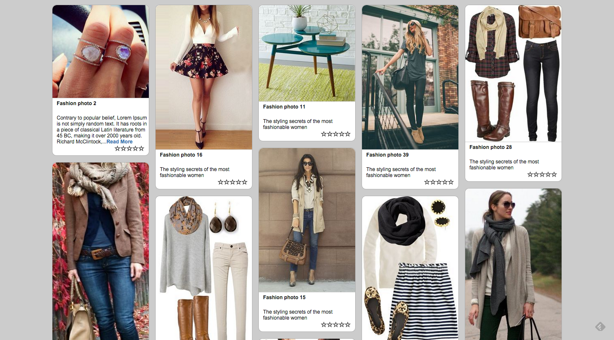

> This is a fashion discovery platform. I started off with a working wireframe mock using a pinterest-like board layout, feeding off a RESTful API backend delivering JSON data via AJAX calls, and using infinite scroll to add content to the page as the user scrolls down.

## Table of Contents


1. [Usage](#usage)
2. [Development](#development)
3. [Installing Dependencies](#installing-dependencies)
4. [Reasoning behind technical choices](#reasoning-behind-technical-choices)
5. [Author](#author)

## Usage

> To use fashion-discovery-platform, please follow these three steps

1. Clone this repo into your local.
2. Follow [Installing dependencies](#Installing Dependencies)
3. Open your favorate browser and go to localhost:8000

## Development
- vanilla JS
- HTML5
- CSS3
- jQuery 
- Angular
- Angular-Bootstrap
- Lo-dash 
- RESTful API
- Express.js

## Installing Dependencies

First you need to have node.js installed in your computer.
Then From within the root directory:

```sh
npm install -g bower
npm install
bower install
node server.js
```

## Reasoning behind technical choices
- jQuery: I needed to download Jquery when I use Angular-bootstrap.
- Angular-bootstrap: For the five start rating, I used ui.bootstrap.rating.
- CSS3: It took care pinterest-like layout and other cool details. 
- Lo-dash: Why Lo-dash? Why not, it is better than Underscore.js!
- Express.js: Hard worker, did all the backend job. 

## Author
Xianhui Feng 